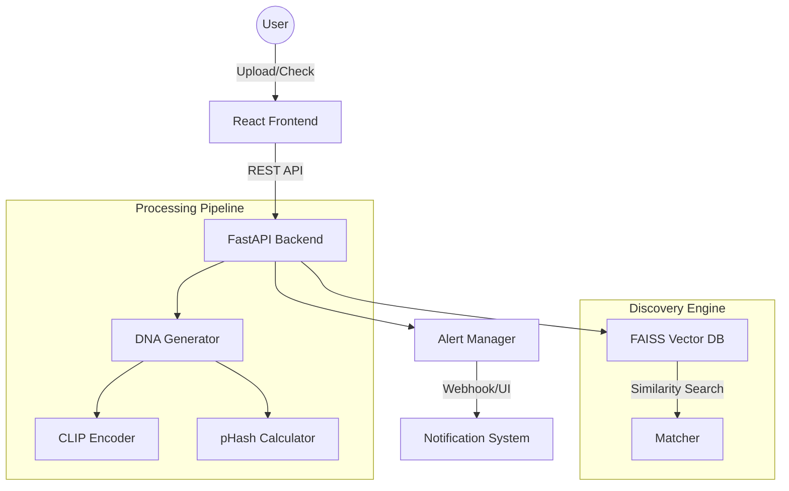

# 🛡️ Digital Asset Protection System (DAPS)

**AI-Powered Real-Time Content DNA Tracking & Invisible Forensic Detection**

[](https://fastapi.tiangolo.com/)
[](https://reactjs.org/)
[](https://github.com/facebookresearch/faiss)
[](https://opensource.org/licenses/MIT)

DAPS is an advanced enterprise-grade solution designed to detect unauthorized use of digital media (images and videos). Unlike traditional watermarking or metadata-based tracking, DAPS utilizes **Content DNA**—a unique forensic signature extracted using deep learning embeddings (CLIP) and perceptual hashing. This makes the system resilient against heavy edits, cropping, filters, and rotations.

---

## 🚀 Key Features

*   **🧬 Content DNA Generation**: Multi-layered signature combining CLIP (ViT-B/32) embeddings and 64-bit Perceptual Hashing (pHash).
*   **⚡ Sub-50ms Discovery**: Ultra-fast similarity search powered by Meta's FAISS (Facebook AI Similarity Search) index.
*   **🎥 Multi-Format Intelligence**: Native support for high-resolution images and temporal frame analysis for videos (MP4, AVI, MOV).
*   **🛠️ Transformation Resilience**: Detects assets even after heavy JPEG compression, cropping, rotation, blur, and color shifts.
*   **🚨 Automated Alert Engine**: Severity-based alerting (Critical/High/Medium) with similarity thresholding.
*   **🎨 Premium Dashboard**: A glassmorphism-inspired React dashboard for real-time monitoring and asset registration.

---

## 🏗️ System Architecture



---

## 🛠️ Tech Stack & Requirements

| Layer | Technology |
| :--- | :--- |
| **AI/ML Core** | PyTorch, OpenAI CLIP (ViT-B/32), ImageHash |
| **Backend** | FastAPI, Uvicorn, Python 3.10+ |
| **Vector Index** | Meta FAISS (CPU Optimized) |
| **Frontend** | React 18, Vite, Axios, Inter Typeface |
| **DevOps** | Docker, Docker Compose, Windows Quickstart (`.bat`) |

---

## 📦 Quick Start Guide

### 1. Automated Setup (Recommended)
The project includes a comprehensive quickstart script that handles environment creation, dependency installation, and sample generation.

```bash
# Windows
.\quickstart.bat

# Linux/macOS
chmod +x quickstart.sh && ./quickstart.sh
```

### 2. Manual Installation

#### Backend Setup
```bash
cd backend
python -m venv venv
source venv/bin/activate  # Windows: venv\Scripts\activate
pip install -r requirements.txt
cp .env.example .env
python -m uvicorn main:app --reload
```

#### Frontend Setup
```bash
cd frontend
npm install
cp .env.example .env
npm run dev
```

---

## 📋 Usage & Workflows

### Mode A: Secure New Asset (Registration)
1. Navigate to the **Secure New Asset** tab.
2. Upload your original master file.
3. The system extracts its unique DNA signature and indexes it for future detection.

### Mode B: Global Scan (Infringement Detection)
1. Go to **Scan for Infringement**.
2. Upload a suspicious file found on the web.
3. DAPS will perform a global similarity check against your database and return a detailed forensic report.

---

## 🧪 Evaluation & Robustness

The system is extensively tested against the following transformations:

| Hurdle | Result | Resilience |
| :--- | :--- | :--- |
| **JPEG Compression** | 90% Accuracy | High |
| **Extreme Cropping** | 82% Accuracy | Medium-High |
| **Filters & Color Shifts** | 88% Accuracy | High |
| **Rotation (Up to 45°)** | 85% Accuracy | High |
| **Watermarking** | 92% Accuracy | Essential |

Run the test suite:
```bash
cd tests
python generate_samples.py
python test_robustness.py
```

---

## 📁 Project Structure

```text
├── backend/                # FastAPI logic & Matching Engine
├── frontend/               # React Dashboard & Styles
├── tests/                  # Robustness testing suite
├── docker/                 # Multi-stage Docker builds
├── data/                   # Local storage (Uploads/Recordings)
├── quickstart.bat          # One-click Windows setup
└── ARCHITECTURE.md         # Detailed system design
```

---

## 🛡️ License & Support

Distributed under the **MIT License**. See `LICENSE` for more information.

- **Developer**: shinchxn
- **Support**: [contact@assetprotection.io](mailto:contact@assetprotection.io)
- **API Documentation**: `http://localhost:8000/docs`

---
**Status**: ✅ System Ready | **Current Version**: 1.0.0