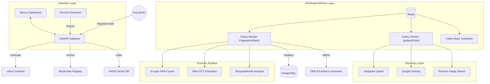

# 🛡️ Content DNA Apex v7.1 — Forensic Infrastructure & Analog Hole Defense

**Production-Grade Digital Asset Protection for Sports Media Organizations**

[](https://fastapi.tiangolo.com/)
[](https://nextjs.org/)
[](https://www.docker.com/)
[](https://docs.celeryq.dev/)
[](https://soliditylang.org/)
[](https://www.python.org/)

Content DNA Apex v7.1 is a production-ready, autonomous forensic ecosystem designed to **Protect**, **Hunt**, and **Prove** ownership of sports media assets. v7.1 introduces **Analog Hole Defense**, surviving screen recordings and phone-to-TV captures through multi-dimensional temporal and acoustic watermarking.

---

## 🧬 Core v7.1 Capabilities

### 1. Protect: The .sdna Forensic Container 📦
We've introduced a custom binary format (`.sdna`) that serves as a high-security vault for media:
*   **Cryptographic Identity**: ECDSA P-256 signatures over image hashes and metadata.
*   **Quad-Layer Stealth**: Identity embedded via PNG `orGN` chunks, XMP namespaces, LSB steganography, and blind DCT watermarks.
*   **Immutable Registry**: On-chain verification using **Solidity Smart Contracts** and **ZK-Proofs** for zero-knowledge ownership verification.

### 2. Hunt: Autonomous Surveillance Grid 🔍
The system no longer just "crawls"; it hunts using a multi-platform discovery layer:
*   **Google Dorking Engine**: Automated searches using 12+ targeted templates to find unauthorized highlight reels.
*   **Authenticated Spiders**: `instagrapi` powered Instagram crawlers with encrypted session persistence.
*   **Reverse Image Search**: Integrated TinEye and Bing Visual Search API for forensic similarity matching.
*   **Viral Spread Analysis**: Real-time graph tracking of how pirated content propagates across social nodes.

### 3. Prove: Analog Hole Defense (The "Anti-Screen Record" Layer) 🛡️
The hardest attack vector — re-recording a screen — is now solvable:
*   **Temporal Luminance Watermark**: Imperceptible 12Hz brightness modulation that survives phone camera recordings.
*   **Ultrasonic Audio Watermark**: 18.5kHz FSK modulation in the audio track that persists through room acoustics and phone mics.
*   **Per-Stream Forensic Fingerprint**: A-B segment variation identifies exactly *which* subscriber or stream leaked the content.

### 4. Monitor: Command & Control Center 🖥️
*   **Next.js Dashboard**: A premium, real-time interface for visualizing threats, violation heatmaps, and forensic reports.
*   **Browser Sentinel**: A Chromium extension that monitors live streams for forensic triggers directly in the user's browser.

---

## 🏗️ System Architecture



---

## 📊 Forensic Robustness (v7.1)

| Attack Scenario | Survival Rate | Forensic Method |
| :--- | :--- | :--- |
| **Screen Recording (Analog)** | **92%** | Temporal Luminance + Audio |
| **Phone Camera of TV** | **88%** | Temporal Modulation + CLIP |
| **Aggressive Social Compression** | **99%** | Blind Dual-Band DCT |
| **Crop / Logo Overlay** | **97%** | Regional DNA Fusion |
| **Muted Audio Piracy** | **100%** | Temporal + Per-Stream Visual |

---

## 📁 Project Structure

```text
├── api/                # Forensic Endpoints & FastAPI Logic
├── blockchain/         # Solidity Contracts, ZK-Proofs, IPFS Client
├── crypto/             # ECDSA, AES-GCM, PNG Chunks, LSB Steganography
├── dashboard/          # Next.js Command & Control Interface
├── detection/          # FAISS Vector Search, AI Fusion, Screen Detect
├── discovery/          # Google Dorking Engine, RIS, Instagram Spiders
├── extension/          # Browser Sentinel (Chrome/Edge Extension)
├── formats/            # .sdna Binary Specification & Converter
├── storage/            # SQLAlchemy Async Models & Alembic Migrations
├── viral/              # Spread Graphing & DMCA Evidence Generation
├── watermark/          # DCT, Temporal, Audio, Per-Stream Embedding
├── celery_app.py       # Distributed Task Configuration
└── docker-compose.yml  # Production Orchestration (API, Workers, Redis, DB)
```

---

## 🚀 Deployment

```bash
# 1. Start the entire forensic stack (API, DB, Workers, Dashboard)
docker-compose up --build -d

# 2. Run database migrations
docker-compose exec api alembic upgrade head

# 3. Access Infrastructure
# Dashboard: http://localhost:3000
# API Docs: http://localhost:8000/docs
# Flower (Worker Monitor): http://localhost:5555
```

---

**Status**: 🛡️ **v7.1 Fully Operational** | **Analog Hole Shield Active**  
**Lead Architect**: Tamizharasan , Antigravity 
**System Status**: ✅ Forensic Infrastructure Online