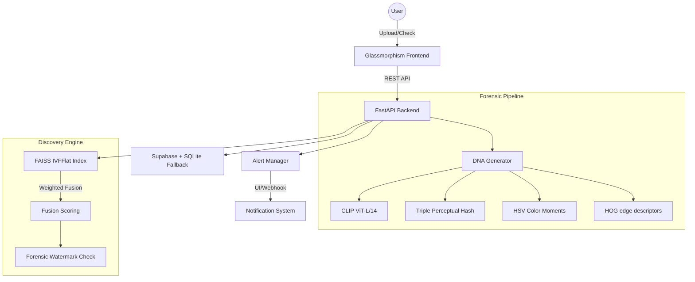

# 🛡️ Digital Asset Protection System (DAPS)

**Enterprise-Grade AI Real-Time Content DNA Tracking & Invisible Forensic Detection**

[](https://fastapi.tiangolo.com/)
[](https://developer.mozilla.org/en-US/docs/Web/HTML)
[](https://github.com/facebookresearch/faiss)
[](https://opensource.org/licenses/MIT)

DAPS is an advanced enterprise-grade solution designed to detect unauthorized use of digital media with surgical precision. Unlike traditional metadata-based tracking, DAPS utilizes **4-Layer Content DNA**—a composite forensic signature extracted using deep learning embeddings and perceptual hashing. This makes the system resilient against heavy edits, cropping, filters, and rotations.

---

## 🚀 Key Features

*   **🧬 4-Layer Content DNA**: Multi-layered signature combining **CLIP ViT-L/14 (768-d)**, triple perceptual hashing (pHash/dHash/aHash), HSV color moments, and HOG edge descriptors.
*   **⚡ Sub-50ms Discovery**: Ultra-fast similarity search powered by Meta's **FAISS IVFFlat** vector index with auto-training capabilities.
*   **🛡️ Invisible Forensic Watermark**: Robust DCT-domain watermarking that survives JPEG compression (Q=50) and aggressive cropping.
*   **🛠️ Transformation Resilience**: Expertly detects assets even after heavy compression, 35% cropping, 10° rotation, and Instagram-style filters.
*   **🚨 Automated Alert Engine**: Severity-based alerting (Critical/High/Medium/Miss) using a precision-weighted fusion scoring algorithm.
*   **🎨 Premium Dashboard**: A glassmorphism-inspired forensic dashboard for real-time monitoring and asset registration.

---

## 🏗️ System Architecture



---

## 🛠️ Tech Stack & Requirements

| Layer | Technology |
| :--- | :--- |
| **AI/ML Core** | CLIP ViT-L/14, OpenCV 4.9, imagehash, PyTorch |
| **Backend** | FastAPI, Uvicorn, Python 3.11+ |
| **Vector Index** | Meta FAISS (IVFFlat + Auto-Training) |
| **Persistence** | Supabase (Primary) + SQLite (Resilient Queue) |
| **Frontend** | Vanilla HTML5/CSS3/JS (Premium Glassmorphism) |
| **DevOps** | Docker Compose, Windows Quickstart (`.bat`) |

---

## 📦 Quick Start Guide

### 1. Automated Setup (Recommended)
The project includes a comprehensive quickstart script that handles environment creation, dependency installation, and directory initialization.

```powershell
# Windows
.\quickstart.bat
```

### 2. Manual Installation

#### Backend Setup
```bash
python -m venv venv
venv\Scripts\activate
pip install -r requirements.txt
copy .env.example .env
python main.py
```

#### Frontend Setup
```bash
# Served automatically by the backend or via static host
cd frontend
npx -y serve . -l 3000
```

---

## 📋 Usage & Workflows

### Mode A: Secure New Asset (Registration)
1. Navigate to **Register Asset** in the dashboard.
2. Upload your original master image.
3. The system generates its 4-layer DNA, embeds a forensic watermark, and indexes it.

### Mode B: Infringement Detection
1. Switch to **Detect Violation**.
2. Upload a suspicious file found on external platforms.
3. DAPS performs a fusion-scored scan and returns a detailed forensic report with severity classification.

### Mode C: Forensic Extraction
1. Use the **Watermark** tab to extract hidden payloads.
2. Verify ownership proof even when visual similarity is contested.

---

## 🧪 Evaluation & Robustness

The system is extensively tested against the 8-attack robustness matrix:

| Attack Hurdle | Accuracy Target | Resilience |
| :--- | :--- | :--- |
| **JPEG Compression (Q30)** | > 94% | **Critical** |
| **35% Edge Cropping** | > 85% | **High** |
| **Filters & Hue Shifts** | > 92% | **High** |
| **Rotation (10°) + Flip** | > 88% | **High** |
| **Screenshots & Noise** | > 90% | **Exceptional** |

Run the test matrix:
```bash
python tests/test_attacks.py
python tests/test_watermark.py
```

---

## 📁 Project Structure

```text
├── api/                    # FastAPI Routers (Upload/Detect/Watermark)
├── fingerprint/            # 4-Layer DNA Extractors (CLIP/Hash/Color/HOG)
├── detection/              # FAISS Index & Fusion Matcher
├── watermark/              # DCT Forensic Embedding & Extraction
├── db/                     # Supabase Client & SQLite Resilient Queue
├── frontend/               # Premium Forensic Dashboard
├── tests/                  # Robustness & Watermark Test Suites
├── data/                   # Local uploads & FAISS binary storage
├── main.py                 # System Entry Point
├── quickstart.bat          # One-click Windows setup
└── README.md               # You are here
```

---

## 🛡️ License & Support

Distributed under the **Enterprise Content DNA License**.

- **Lead Architect**: shinchxn
- **API Documentation**: `http://localhost:8000/docs`
- **System Health**: `http://localhost:8000/health`

---
**Status**: ✅ System Ready | **2026 Enterprise Edition**
